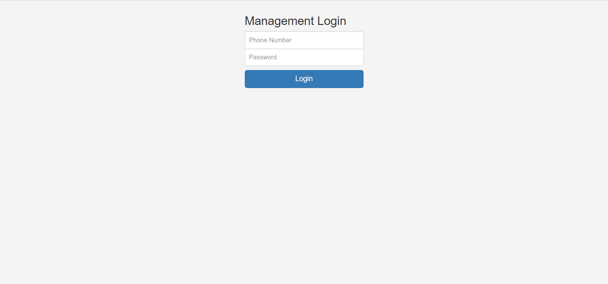
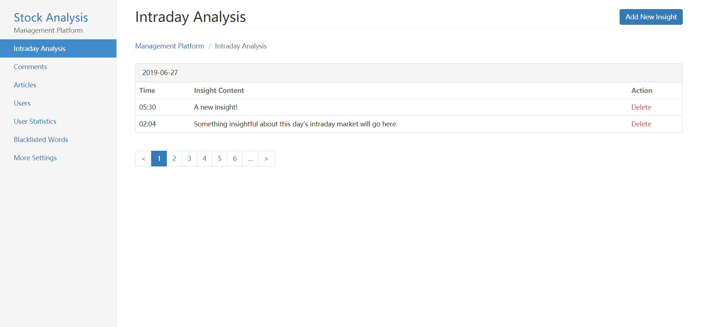
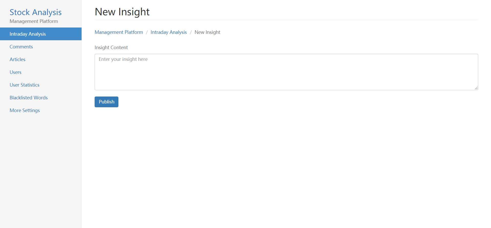
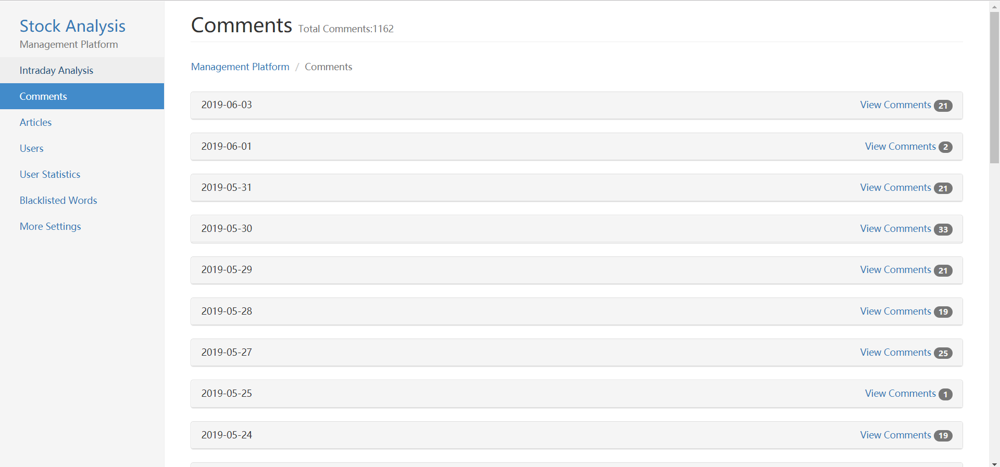
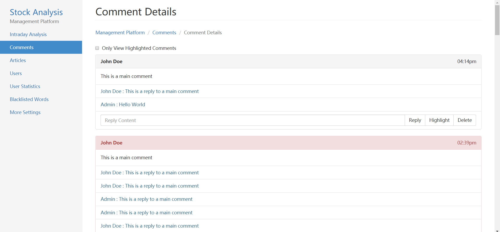
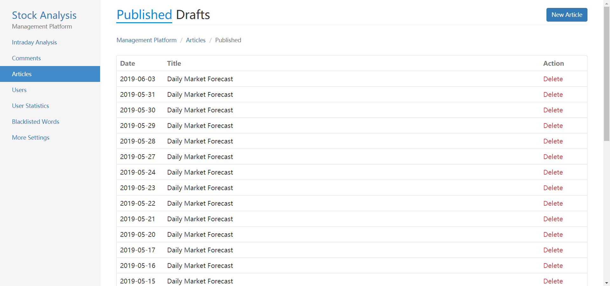
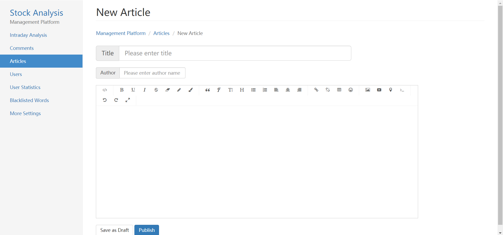
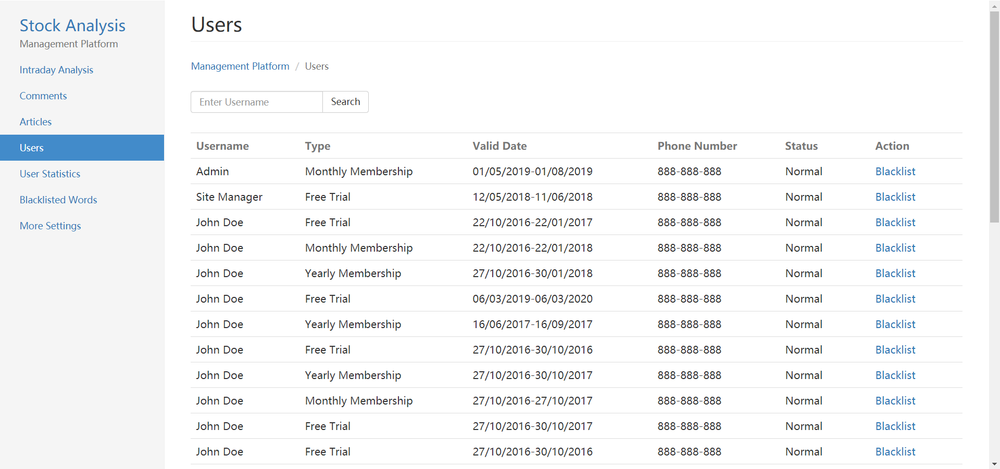
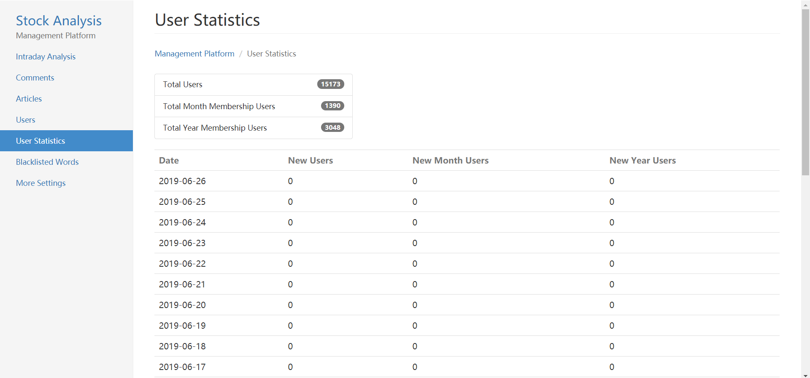

# Management Site For Stock Analysis Subscription Service
An online management site for a stock analysis subscription service. I built the backend of this site using PHP and SQL. 

  

  

  

Note: all data show in screenshots are dummy data (real data is not shown in order to protect the business and user's privacy)

## :star: Introduction 
This is the backend code for a management site of an online stock analysis subscription service located in China. The service offers several features such as live intraday analysis, daily stock forecasts, and a comments section where users can directly ask questions to the host. These features are all located inside the service's wechat app (which is not shown here). However, in order to manage all the data that goes through this service, a seperate management site is needed. I was tasked with creating the backend code for this management site.

## :pushpin: Features 
The management site's main goal is to manage all of the data on the stock analysis service. This type of data management includes:
- Adding and removing insights (comments about the intraday market) on the intraday analysis page
- Writing, editing, and publishing articles (such as stock forecasts)
- Replying, removing and deleteing comments from users
- Viewing all user information and statistics
- Adding and removing blacklisted words (prevents swear words from being posted in comments)
- Configuring other settings
